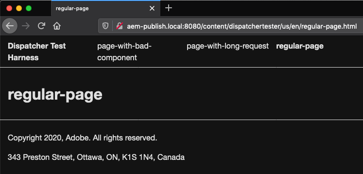
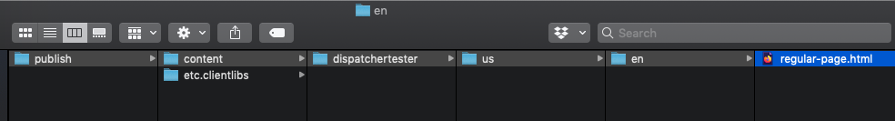

# AEM 6.5 Dispatcher Experiments

This repository contains a collection of Dispatcher experiments in take-home lab format. The content is intended for intermediate to advanced AEM developers and customizers.

## Goal

The goal of these experiments is to raise awareness about the Dispatcher, and provide a project for test driving its feature set.

## Non-Goals

This repo does not attempt to prescribe a one-size-fits-all configuration for the dispatcher. Due to the myriad use cases that AEM supports, it would be impossible to do so. Instead, pick and choose concepts from the below experiments and try them out on your project.

## Getting set up

You will need the following SDKs, tools, and apps installed to work through the experiments:

- Java `11.0.*`
- Maven `3.6.*`
- Node `10.15.*`
- [JMeter](https://jmeter.apache.org/)
- [VisualVM](https://visualvm.github.io/)

You will also need a local AEM author/publish/dispatcher setup:

- AEM 6.5 author instance running on `:4502`
- AEM 6.5 publish instance running on `:4503`
    - Ideally, both instances will have the latest [Service Pack](https://docs.adobe.com/content/help/en/experience-manager-65/release-notes/service-pack/sp-release-notes.html) installed
- Dispatcher accessible at `aem-publish.local:8080`
    - macOS Catalina & Mojave users can find [macOS dispatcher setup instructions here](docs/Local-Dispatcher-macOS.md)
    - Windows users can find [IIS/Windows 10 instructions here](docs/Local-Dispatcher-Windows.md)
- Cache flushing agent [configured on the Publish instance](docs/Flush-agent-setup.md)

You will need to install the AEM project code contained in `aem-project/` on your local author and publish instances:

- Ensure your Maven settings.xml file includes a profile for the [Adobe Maven Repository](https://helpx.adobe.com/ca/experience-manager/kb/SetUpTheAdobeMavenRepository.html)
- Build and install the project code on your local author and publish:

```
cd aem-project/
mvn -PautoInstallSinglePackage -PautoInstallSinglePackagePublish clean install
```

Ready? Confirm by checking:

- Navigate to http://aem-publish.local:8080/content/dispatchertester/us/en/regular-page.html. The rendered page should look like this:


- And, the dispatcher docroot (cache directory) should contain a static copy of this page:


# Experiments

## 1. Effect of `Re-fetching Dispatcher Flush`

In the HelpX article [Optimizing the Dispatcher cache](https://helpx.adobe.com/ca/experience-manager/kb/optimizing-the-dispatcher-cache.html#refetching-flush), the concept of "Re-fetching Dispatcher Flush" is introduced. This experiment shows the impact.

[⇨ Effect of Re-fetching Dispatcher Flush](experiments/refetching-flush)

## 2. Effect of a `/statfileslevel` greater than 0

The configuration included in the dispatcher download contains a `/statfileslevel` set to 0. This experiment demonstrates the performance impact that can be achieved by increasing this value. 

[⇨ Effect of a `/statfileslevel` greater than 0](experiments/statfileslevel)

## 3. Effect of an `ignoreUrlParams` allow list

Configuring `ignoreUrlParams` in an allow list manner is important to improve your cache hit ratio, which in turn can save your publish tier from unnecessary content rendering.

[⇨ Effect of an `ignoreUrlParams` allow list](experiments/ignoreUrlParams)

## 4. Effect of the `gracePeriod` setting

`gracePeriod` is a relatively new feature which can reduce spikes in load when a number of cache invalidation events occur in quick succession.

[⇨ Effect of the `gracePeriod` setting](experiments/gracePeriod)

### Contributing

Contributions are welcomed! Read the [Contributing Guide](./.github/CONTRIBUTING.md) for more information.

### Licensing

This project is licensed under the Apache V2 License. See [LICENSE](LICENSE) for more information.
