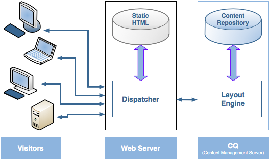
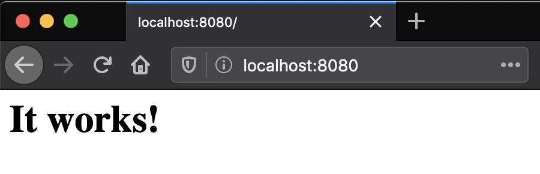
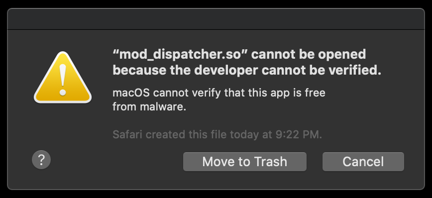
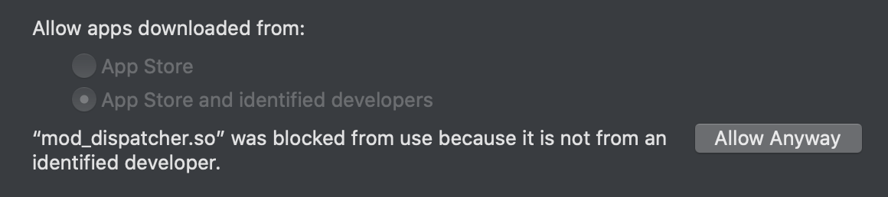
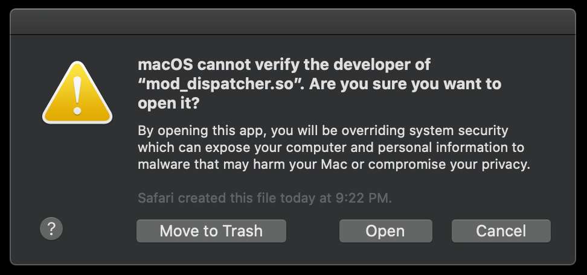

# Running a Dispatcher Locally on macOS

In a typical AEM implementation, the dispatcher fits into the AEM publish tier like so (note: no CDN pictured below):



These instructions cover setting up a local dispatcher on Apache 2.4, accessible at `http://aem-publish.local:8080/`.

### Apache httpd

To [avoid issues](https://helpx.adobe.com/experience-manager/kt/platform-repository/using/dispatcher-macos-technical-video-setup.html) with using the dispatcher module on the Apache version included with macOS, Install Apache 2.4 with [Homebrew](https://brew.sh/):

    brew install httpd

Ensure the version you installed is available via `httpd`:

    ls -l "$(which httpd)"
    
    # should return "... /usr/local/bin/httpd -> ../Cellar/httpd/2.4.43/bin/httpd"
    # "/Cellar/httpd" indicates the homebrew version is being used.

> Do you see `/usr/sbin/httpd` instead? Try including `/usr/local/bin` in your PATH. Place this line in .bashrc or .zshrc, depending on your shell).

    # optional - only needed if the Homebrew httpd is not being found
    export PATH="/usr/local/bin:$PATH"
    
Locate the file which Apache is reading it's config from:

    httpd -V
    # look for the SERVER_CONFIG_FILE path, e.g. `-D SERVER_CONFIG_FILE="/usr/local/etc/httpd/httpd.conf"`

Make note of this path - you'll need it below.

Start Apache:

    sudo apachectl start
    # once you've made configuration changes you'll want to run `sudo apachectl restart` instead 

Verify you can access Apache at the `Listen` address specified in your httpd.conf file (`8080` in my case): http://localhost:8080/. You should see the following:



> Did you see the following message printed to the console? "AH00558: httpd: Could not reliably determine the server's fully qualified domain name, using Your-computer-name.local. Set the 'ServerName' directive globally to suppress this message" - not to worry if so, it can be ignored for a local setup.

### Create key directories

The following directories will be used for storing the dispatcher module, it's configuration, and the cached documents:

```
sudo mkdir -p /private/libexec/apache2
sudo mkdir -p /private/etc/apache2/vhosts
sudo mkdir -p /private/etc/apache2/conf
sudo mkdir -p /Library/WebServer/docroot/publish
```

Update the owner of the cache docroot to the `_www` user and `_www` group:

    sudo chown _www:_www /Library/WebServer/docroot/publish

### Download the Dispatcher module

Download the latest release of the Dispatcher module from here: https://docs.adobe.com/content/help/en/experience-manager-dispatcher/using/getting-started/release-notes.html#apache

You are most likely looking for the Apache 2.4 macOS release, named `dispatcher-apache2.4-darwin-x86_64-4.3.3.tar.gz` - 4.3.3 is the most recent release at the time of writing.

Open the dispatcher-apache2.4-darwin-x86_64-VERSION.tar.gz archive to extract it.

### Install the Dispatcher module

Move the `dispatcher-apache2.4-VERSION.so` module to the `/private/libexec/apache2` directory, and rename it to `mod_dispatcher.so`. Assuming a dispatcher version of 4.3.3, run:

    sudo mv dispatcher-apache2.4-4.3.3.so /private/libexec/apache2/mod_dispatcher.so

You may also use a symlink, if you prefer.

### Load the Dispatcher module

This repo contains a sample [httpd.conf](../dispatcher-config-basic/usr/local/etc/httpd/httpd.conf) which you can use as-is to replace the existing httpd.conf that ships with Apache. From the root of this repo:

    cp dispatcher-config-basic/usr/local/etc/httpd/httpd.conf /usr/local/etc/httpd/httpd.conf
    
Note the destination path above. This path should match the `SERVER_CONFIG_FILE` param printed by `httpd -V`.

Alternatively, make note of the configuration following the comment `#### DISPATCHER CONFIG ####` (lines 184 - 252), and include it in your own httpd.conf.

Try running `httpd -V` again with your configuration in place. Do you see an error dialog? Are you on macOS Catalina?

#### macOS Catalina (v10.15)

If you are running macOS Catalina, you may see the following error dialog displayed when you attempt to run httpd:
 

 
This is due to the changes in your httpd.conf file which are instructing Apache to load the unsigned dispatcher module.

To allow the dispatcher module to run, open System Preferences -> Security & Privacy -> General, and grant an exception to mod_dispatcher.so:



Finally, run `httpd -V` again. You will need to confirm that you want to open mod_dispatcher.so:




### Configure the dispatcher

This repo includes a fully configured sample [dispatcher.any](../dispatcher-config-basic/private/etc/apache2/conf/dispatcher.any) file to get you up and running quickly.

The included [httpd.conf](../dispatcher-config-basic/usr/local/etc/httpd/httpd.conf) file instructs the dispatcher to read it's configuration from `/private/etc/apache2/conf/dispatcher.any`. To use the included [dispatcher.any](../dispatcher-config-basic/private/etc/apache2/conf/dispatcher.any) file, copy it over to this location. From the root of this repo, run:

    sudo cp dispatcher-config-basic/private/etc/apache2/conf/dispatcher.any /private/etc/apache2/conf/dispatcher.any

### Configure the publish virtual host

The next step is to configure our `aem-publish.local` virtual host.

Copy the included [aem-publish.local.conf](../dispatcher-config-basic/private/etc/apache2/vhosts/aem-publish.local.conf) to `/private/etc/apache2/vhosts`:

    sudo cp dispatcher-config-basic/private/etc/apache2/vhosts/aem-publish.local.conf /private/etc/apache2/vhosts/aem-publish.local.conf

Lastly, add a line to `/etc/hosts` to point `aem-publish.local` back at `127.0.0.1`:

    127.0.0.1 aem-publish.local

### Restart Apache

Use the following command to restart the Apache webserver:

    sudo apachectl restart

### Did it work?

Try to access the following WeRetail page (assumes sample content is installed): http://aem-publish.local:8080/content/we-retail/us/en.html

### Check the cache

Have a look in the cache document root, and you should see a familiar directory structure:

    cd /Library/WebServer/docroot/publish
    find . -type d -maxdepth 4

The above `find` command should print similar output to the following, assuming http://aem-publish.local:8080/content/we-retail/us/en.html has been loaded at least once:

```
.
./content
./content/we-retail
./content/we-retail/us
./content/we-retail/us/en
./etc.clientlibs
./etc.clientlibs/weretail
./etc.clientlibs/weretail/clientlibs
./etc.clientlibs/weretail/clientlibs/clientlib-site
./etc.clientlibs/weretail/clientlibs/vendor
./etc.clientlibs/core
./etc.clientlibs/core/wcm
./etc.clientlibs/core/wcm/components
./etc.clientlibs/clientlibs
./etc.clientlibs/clientlibs/granite
./etc.clientlibs/foundation
./etc.clientlibs/foundation/clientlibs
```

... which indicates that your Dispatcher is working as expected. 🎉

Refer back to the [Getting set up](../README.md#getting-set-up) steps to complete any remaining setup, and then continue on to the Experiments.
