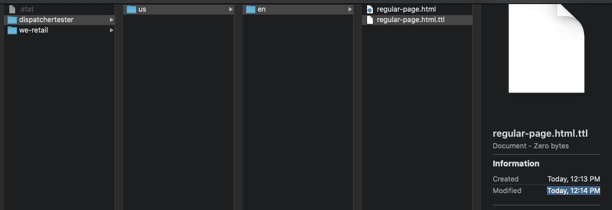
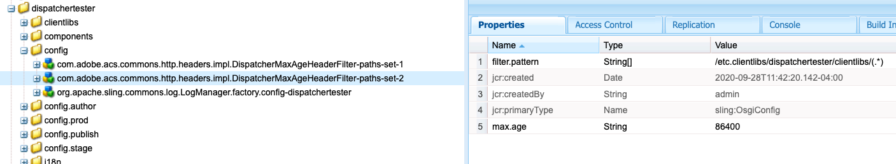
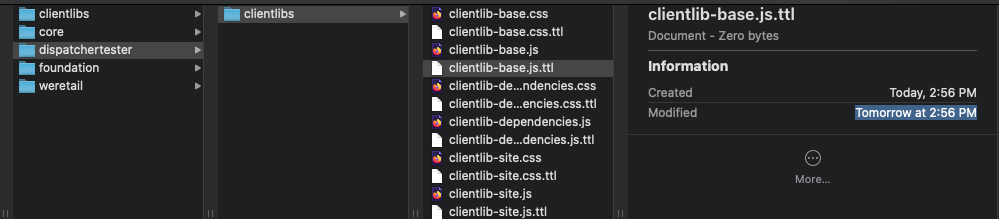
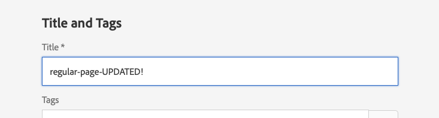
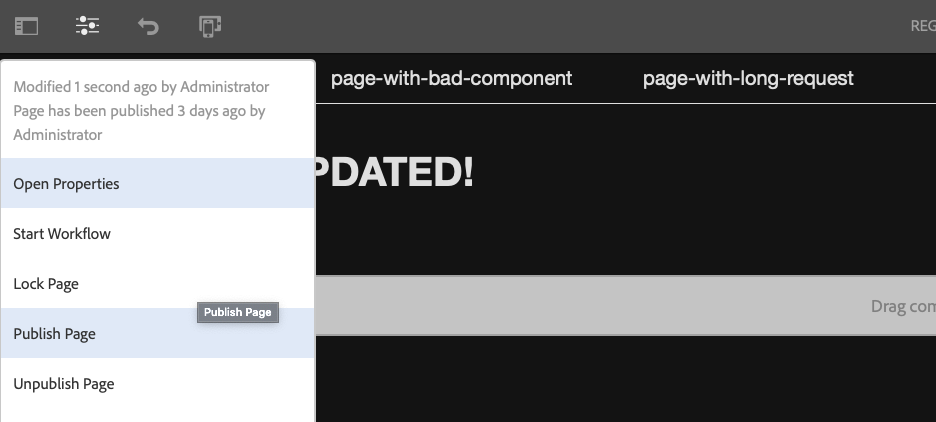
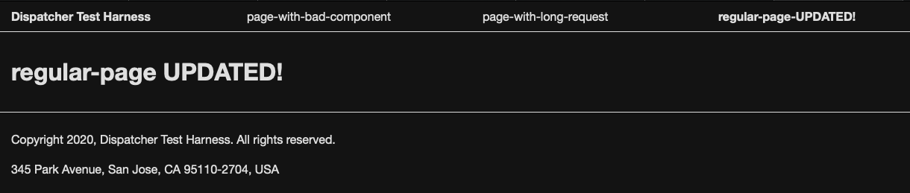
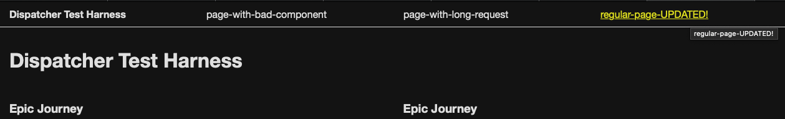

# Effect of `enableTTL`

Dispatcher versions 4.1.11 and greater can be configured to respect a time-to-live (TTL) based content "timeout". TTL headers (`Cache-Control` or `Expires`) must be included in responses sent from the publish tier in order for the dispatcher to know how long a cached file should "live" for in the cache. When this configuration is enabled (and reasonable TTL values are set), there is no longer a need for a dispatcher flush agent.

## Compatibility

The `enableTTL` configuration can be used with both AEM 6.5 and AEM as a Cloud Service. However, the replication framework from previous versions of AEM is no longer used to publish pages on AEM as a Cloud Service (read the details here: [Content Distribution](https://docs.adobe.com/content/help/en/experience-manager-cloud-service/core-concepts/architecture.html#content-distribution)). You may also find the AEMaaCS [Caching documentation](https://docs.adobe.com/content/help/en/experience-manager-cloud-service/implementing/content-delivery/caching.html) of interest, which goes into more detail about the differences.

## Setup

For this experiment, you will need to install the ACS AEM Commons package on your local **Publish** instance. We'll be using the [Dispatcher TTL](https://adobe-consulting-services.github.io/acs-aem-commons/features/dispatcher-ttl/index.html) feature to set the `max-age` of our content via an OSGi configuration. You can download the latest release here (v4.8.4 at the time of writing): [adobe-consulting-services.github.io/acs-aem-commons/](https://adobe-consulting-services.github.io/acs-aem-commons/)

Next, install it on your local publish instance via Package Manager (you may need to [sign in first](http://localhost:4503/libs/granite/core/content/login.html)): [localhost:4503/crx/packmgr/index.jsp](http://localhost:4503/crx/packmgr/index.jsp)

To verify that the package is installed correctly and has interpreted our [DispatcherMaxAgeHeaderFilter OSGi config](https://github.com/adobe/aem-dispatcher-experiments/blob/enableTTL/aem-project/ui.apps/src/main/content/jcr_root/apps/dispatchertester/config/com.adobe.acs.commons.http.headers.impl.DispatcherMaxAgeHeaderFilter-paths-set-1.xml#L5) configuration included in this repo's `aem-project/`, (which sets the `max.age` of `/content/dispatchertester/*` content to 60 seconds), issue the following request with cURL:

```
curl -H "Server-Agent: Communique-Dispatcher" -D - http://localhost:4503/content/dispatchertester/us/en.html -o /dev/null
```

Ensure the `Cache-Control: max-age=60` header is included in the response before continuing. 

> Is the `Cache-Control` header missing? Ensure you've installed the latest code in `aem-project/` to your publish instance. To do so with a single command, (from the `aem-project/` dir): `mvn -PautoInstallSinglePackagePublish clean install`.

Next, set the `enableTTL` flag to "1" by un-commenting the following line in your dispatcher.any configuration (around line 255):

```
# /enableTTL "1"
```

You will need to restart Apache for this change to take effect:

```
sudo apachectl restart
```

Clear your dispatcher cache of any existing content. On macOS:

```
sudo rm -rf /Library/WebServer/docroot/publish/*
```

Finally, navigate to regular-page.html and observe the files which are written to the cache:

http://aem-publish.local:8080/content/dispatchertester/us/en/regular-page.html

Result:



Note how the last modified timestamp on this file is actually set _in the future_ by a minute - our `max.age`. Once the current time is _after_ the last modified timestamp on it's .ttl file, the file will be considered stale. 

## In the logs

The dispatcher.log output will differ slightly when using `enableTTL` vs. .stat file-based invalidation.

### With `enableTTL`

With `enableTTL` set and a corresponding .ttl file next to the cached resource which is being requested, you will see log entries that match the below format.

When a cached resource's last modified timestamp is BEFORE the last modified timestamp of it's .ttl file, the file is considered VALID:

```
[..] cache file has not expired: /docroot/content/dispatchertester/us/en.html
[..] cache-action for [/content/dispatchertester/us/en.html]: DELIVER
```

When a cached resource's last modified timestamp is AFTER the last modified timestamp of it's .ttl file, the file is considered STALE:

```
[..] cache file has expired: /docroot/content/dispatchertester/us/en.html
[..] cache-action for [/content/dispatchertester/us/en.html]: CREATE
```

### Without `enableTTL`

When `enableTTL` is not set, or a .ttl file is missing for the resource in question, the logs will read differently. When the cached resource is newer than it's nearest .stat file, the cached file is considered VALID:

```
[..] cache file is newer than lastflush -> use cache [/docroot/content/dispatchertester/us/en.html]
[..] cache-action for [/content/dispatchertester/us/en.html]: DELIVER
```

When it's older than it's nearest .stat file, the file is considered STALE:

```
[..] cache file is older than lastflush -> flush [/docroot/content/dispatchertester/us/en.html]
[..] cache-action for [/content/dispatchertester/us/en.html]: CREATE
```

Ensure you are seeing the "cache file has not expired"/"cache file has expired" format in your local dispatcher logs (on macOS: `/private/var/log/apache2/dispatcher.log`) before proceeding.

## Different TTL values

Depending on your use case, you may decide that a TTL of 5 minutes for .html content is reasonable, but cached .js and .css files should live in the cache for 24 hours (perhaps due to your use of [Versioned Clientlibs](https://adobe-consulting-services.github.io/acs-aem-commons/features/versioned-clientlibs/index.html)).

To achieve this we will create another DispatcherMaxAgeHeaderFilter configuration, which will control the TTL on .js and .css files.

Navigate to CRX/de on your publish instance, and open `/apps/dispatchertester/config`: [localhost:4503/crx/de/index.jsp#/apps/dispatchertester/config](http://localhost:4503/crx/de/index.jsp#/apps/dispatchertester/config)

Create a copy of the existing `DispatcherMaxAgeHeaderFilter` file and paste it next to the original. Rename it's suffix from `set-1` to `set-2`. Make sure to save your changes.

Open the properties of your new node, and set the `filter.pattern` entry to:

```
/etc.clientlibs/dispatchertester/clientlibs/(.*)
```

Additionally, set `max.age` to `86400` (60 seconds in a minute * 60 minutes in an hour * 24 hours in a day = 86400 seconds in a day). This means that all cached items that exist under this path will be able to live in the cache for 24 hours.

Make sure to save your changes in CRX/de. The new node should look like this:



> Note: typically this configuration would be part of the app's source code. We're adding it directly to CRX/de for the sake of speed only 🏎

### Test out the new TTL

With the new Dispatcher TTL config in place on your publish instance, make a request to a known clientlib to see if the `max-age` is returned correctly:

```
curl -H "Server-Agent: Communique-Dispatcher" -D - http://localhost:4503/etc.clientlibs/dispatchertester/clientlibs/clientlib-site.js -o /dev/null
```

Among the headers listed, you should see `Cache-Control: max-age=86400` for this resource.

To confirm we didn't globally change the TTL values for other files, try the original cURL request we made:

```
curl -H "Server-Agent: Communique-Dispatcher" -D - http://localhost:4503/content/dispatchertester/us/en.html -o /dev/null
```

Should return `Cache-Control: max-age=60`. 

Excellent! We now have different TTL values set for different content paths.

Opening the Dispatcher tester "home" page in your browser should result in both the en.html page and it's clientlibs being written to the cache: [aem-publish.local:8080/content/dispatchertester/us/en.html](http://aem-publish.local:8080/content/dispatchertester/us/en.html). 

Taking a look in the cache reveals the last modified timestamp of clientlib-site.js is correct, exactly 24 hours in the future:



## Implications of enableTTL

When the `enableTTL` flag is set and their is a corresponding `<filename>.ttl` file present in the cache, `.stat` files will not be considered when determining whether or not the requested `<filename>` is stale. 

In other words, if the activation of page-A.html occurs which touches a `.stat` file at the root of the cache (assuming a `/statfileslevel` of 0), then page-B.html (a peer of page-A.html) **will not be re-fetched** until it's TTL expires. This is the case even though it's last modified timestamp is now older than it's nearest .stat file.

Need proof? Let's re-enact the above scenario. 

With a TTL of 60 seconds we'll have to work fast. First, navigate to the following pages in separate tabs or windows in prep of the experiment:

- Author, page properties dialog of regular-page.html: [localhost:4502/mnt/overlay/wcm/core/content/sites/properties.html?item=/content/dispatchertester/us/en/regular-page](http://localhost:4502/mnt/overlay/wcm/core/content/sites/properties.html?item=/content/dispatchertester/us/en/regular-page)
- Publish, en.html: [localhost:4503/content/dispatchertester/us/en.html](http://localhost:4503/content/dispatchertester/us/en.html)
- Do not access any pages with the dispatcher yet!

When ready, open en.html via the dispatcher, which will write it to the cache and begin the 60 second timer for this experiment ⏱: [aem-publish.local:8080/content/dispatchertester/us/en.html](http://aem-publish.local:8080/content/dispatchertester/us/en.html)

In the page properties dialog of regular-page.html, change the Title of the page. Click "Save & Close":



Publish regular-page.html via the Page Information popover:



Navigate to regular-page.html through the dispatcher: [aem-publish.local:8080/content/dispatchertester/us/en/regular-page.html](http://aem-publish.local:8080/content/dispatchertester/us/en/regular-page.html) You should see the update you made to the page title:



Navigate to en.html (the "Dispatcher Test Harness" home page): [aem-publish.local:8080/content/dispatchertester/us/en.html](http://aem-publish.local:8080/content/dispatchertester/us/en.html) Look for the regular-page title update in the header:


Uho! How can that be? We've updated a child page and published it. Now a page which shares a common `.stat` file was not determined to be "stale" by the dispatcher? Recall from above: `.stat` files will not be considered when determining whether or not the requested `<filename>` is stale, as long as a corresponding `<filename>.ttl` is present.

Finally, wait out the rest of this 60 second timeout ⏰ ... and refresh en.html [aem-publish.local:8080/content/dispatchertester/us/en.html](http://aem-publish.local:8080/content/dispatchertester/us/en.html):



There it is! Once the TTL has expired (60 seconds in this case) the next request is sent back to the publish instance where the page is re-rendered. Its .ttl is the updated to set a timeout based on the value of it's `Cache-Control: max-age=` (or `Expires` header).

## In summary

This experiment covered how you can configure the dispatcher (versions 4.1.11 and greater) to respect a time-to-live (TTL) based content "timeout". This has some implications with existing `.stat` based invalidations, so it's a good idea to understand the implications that a long timeout could have. 

Recommended reading: [Optimizing the Dispatcher cache](https://helpx.adobe.com/ca/experience-manager/kb/optimizing-the-dispatcher-cache.html) "Using TTLs" section.
