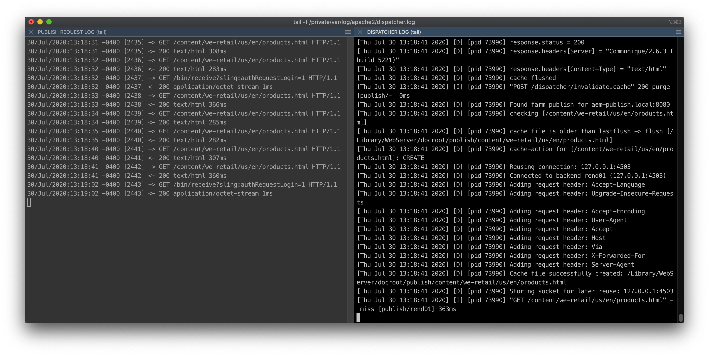
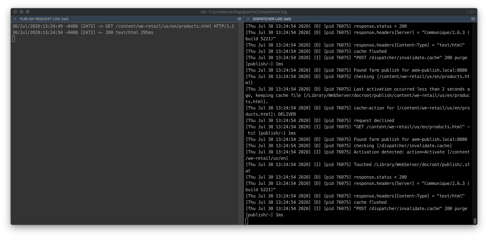

# Effect of the `gracePeriod` setting

This experiment demonstrates the impact that the `gracePeriod` setting can have when a system under load receives a number of cache invalidation events in quick succession.

## Compatibility

This experiment is compatible with both AEM 6.5 and AEM as a Cloud Service.

## Setup

The role of the gracePeriod setting is well stated in the dispatcher.any comments:

> A grace period defines the number of seconds a stale, auto-invalidated resource may still be served from the cache after the last activation occurring. Auto-invalidated resources are invalidated by any activation, when their path matches the /invalidate section above. This setting can be used in a setup, where a batch of activations would otherwise repeatedly invalidate the entire cache.

Open your dispatcher.any config file, and locate the `/gracePeriod` configuration. If you are using the [dispatcher.any from this repository](../../dispatcher-config-basic/private/etc/apache2/conf/dispatcher.any), it will look like so (around line 122):

    #/gracePeriod "2"

It's commented out by default _unless_ you have a codebase that was generated from the [AEM Project Archetype](https://github.com/adobe/aem-project-archetype) with the `aemVersion=cloud` flag set. You can leave it commented out for now.

## Problem

Let's say you have a large site which includes some assets that are generated by AEM. Once the assets are generated, they are all activated one after another to the publish instance. Each activation causes an auto-invalidation to occur which - depending on the configuration of `/invalidate` and `/statfileslevel` - could invalidate all .html files in the cache. This means that the next request for each .html file will make it's way back to the publish instance.

In a high traffic scenario, this can mean there are lots of page renders for the publish instance to process (in addition to handling the incoming activation events). To complicate matters, as soon as the publish instance has finished rendering a page, it is considered "stale" again as soon as the next activation action is received! This cycle can continue until the publish instance ends up overwhelmed.

Let's simulate this scenario using a JMeter script that can both issue end-user GET requests as well as invalidation events to our dispatcher. The latter can be performed by making the following request to the dispatcher (see [Manually Invalidating the Dispatcher Cache](https://docs.adobe.com/content/help/en/experience-manager-dispatcher/using/configuring/page-invalidate.html#manually-invalidating-the-dispatcher-cache) for details):

```
POST http://aem-publish.local:8080/dispatcher/invalidate.cache HTTP/1.1  
CQ-Action: Activate  
CQ-Handle: /content/dispatchertester/us/en/regular-page
Content-Length: 0
```

You can try the above with cURL or Postman yourself.

## Test #1: no gracePeriod

Warm up the cache by navigating to the following page:

- http://aem-publish.local:8080/content/we-retail/us/en/products.html

This will ensure that the 2nd test you run is not skewed by a pre-warmed cached.

The JMeter test script included in this directory is meant to simulate traffic to a specific HTML page combined with an equal amount of invalidation requests. Think of this like a batch of activations all occurring one after another, and intertwined with the rest of the regular site traffic. The test will try to complete as many loops of the single thread group as it can in 10 seconds, which will give us a (very rough) idea of how throughput can change with the use of `gracePeriod`.

With the `gracePeriod` config still commented out, run this test plan from the terminal with the following command:

    jmeter -n -Jjmeterengine.force.system.exit=true -t gracePeriod-test-plan.jmx

Once the test is complete, note the JMeter summary results printed to the console:

```
Run #1:
summary =   2293 in 00:00:10 =  224.5/s Avg:     4 Min:     0 Max:  5033 Err:     0 (0.00%)

Run #2: 
summary =   2798 in 00:00:10 =  279.4/s Avg:     3 Min:     0 Max:  5038 Err:     0 (0.00%)
```

Not bad! However, if you're looking at the publish instance request.log (`crx-quickstart/logs/request.log`, pictured on the left below), you will note that a number of products.html requests made it back to the publisher. The dispatcher is still `DELIVER`'ing most of these requests, but over a longer duration (and with more than a single page being requested), this load can really add up:



## Test #2: gracePeriod set to 2 seconds

Open up the dispatcher configuration file (`sudo vi /private/etc/apache2/conf/dispatcher.any`), and locate the `/gracePeriod` setting (around line 122).

Remove the comment `#` from the gracePeriod line. With this comment removed, the gracePeriod is now set to 2 seconds.

Restart Apache with the following command:

    sudo apachectl restart

Next, re-run the JMeter test plan to simulate a combination of traffic and invalidation requests:

    jmeter -n -Jjmeterengine.force.system.exit=true -t gracePeriod-test-plan.jmx

Once the test is complete, note the JMeter summary results printed to the console:

```
Run #1:
summary =   4058 in 00:00:10 =  405.2/s Avg:     2 Min:     0 Max:  5039 Err:     0 (0.00%)

Run #2: 
summary =   3802 in 00:00:10 =  379.7/s Avg:     2 Min:     0 Max:  5329 Err:     0 (0.00%)
```

Even better. Make note of the publish instance's request.log, and compare to Test #1 where the a number of requests for products.html made it back to the publisher:



In this case only a single request of the ~2k to products.html made it back to the publish instance! This is due to the `gracePeriod` setting: while the invalidation requests arrived continuously throughout the test, there was never enough time between invalidations for the products.html page to be considered "stale" by the dispatcher. 

Recall the comment from the dispatcher.any file:

> A grace period defines the number of seconds a stale, auto-invalidated resource may still be served from the cache after the last activation occurring.

## Conclusion

The `gracePeriod` setting saved a large amount of unnecessary rendering on the publish instance, and enabled the system as a whole to process a higher number of requests as a result. For more on `gracePeriod`, check out the [Understanding Cache](https://helpx.adobe.com/ca/experience-manager/kb/ams-dispatcher-manual/understanding-cache.html) HelpX doc, and look for the "Auto-Invalidate Grace Period" section. 
