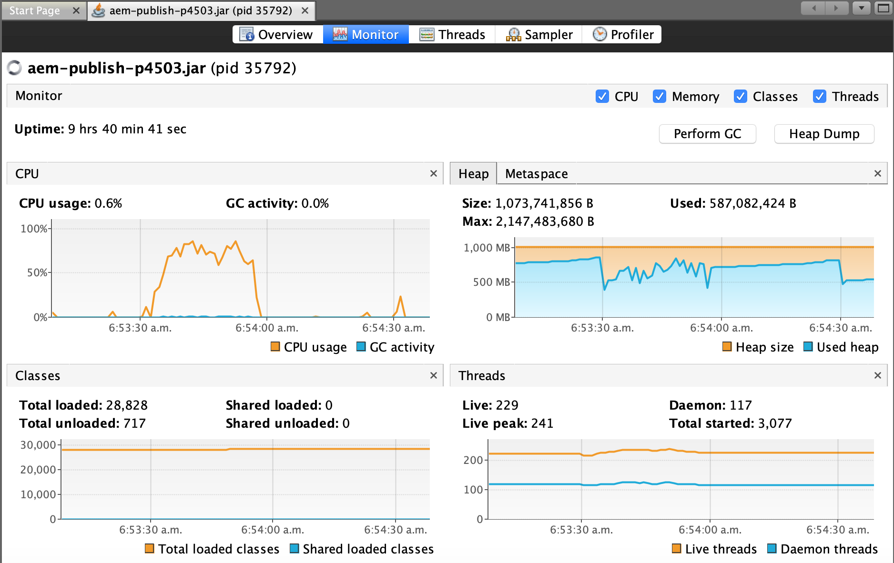
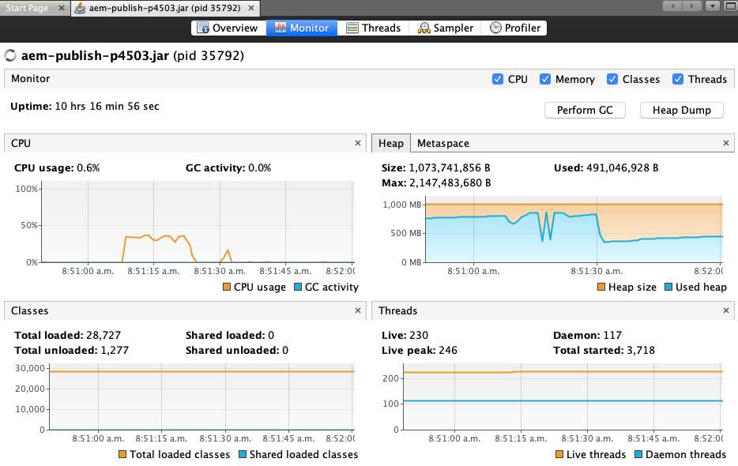

# Effect of an `ignoreUrlParams` allow list

This experiment demonstrates the importance of an `ignoreUrlParams` allow list where you set which URL params your app is expecting. This is the preferred alternative to _ignoring_ a fixed list of known/expected params.

## Compatibility

This experiment is compatible with both AEM 6.5 and AEM as a Cloud Service.

## Setup

Open dispatcher.any, and locate the `/ignoreUrlParams` configuration. If you are using the [dispatcher.any from this repository](../../dispatcher-config-basic/private/etc/apache2/conf/dispatcher.any), it will look like so:

```
  /ignoreUrlParams
    {
    /0001 { /glob "*" /type "deny" }
    /0002 { /glob "utm_campaign" /type "allow" }
    }
```

This theoretical site has set up their `/ignoreUrlParams` configuration like this because they are running a marketing campaign, and want the `utm_campaign` URL param to be ignored so that the cache can consider it a `hit` when this URL param is present - no matter what it's value is set to.

> Does it seem backward to have the "utm_campaign" URL param set to "allow"? Think of it as ALLOW'ing the dispatcher to ignore it.

Confirm that this is working as expected:

1. Navigate to `regular-page` on the dispatcher to warm up the cache: http://aem-publish.local:8080/content/dispatchertester/us/en/regular-page.html
1. Follow dispatcher.log: `tail -f /private/var/log/apache2/dispatcher.log`
1. Now, navigate to `regular-page` again, this time with a `utm_campaign` query param: http://aem-publish.local:8080/content/dispatchertester/us/en/regular-page.html?utm_campaign=summer2020

Note the log output in dispatcher.log:

```
[Wed Jul 15 22:01:47 2020] [D] [pid 86982] checking [/content/dispatchertester/us/en/regular-page.html]
[Wed Jul 15 22:01:47 2020] [D] [pid 86982] Query string ignored: utm_campaign=summer2020
[Wed Jul 15 22:01:47 2020] [D] [pid 86982] cache file is newer than lastflush -> use cache [/Library/WebServer/docroot/publish/content/dispatchertester/us/en/regular-page.html]
[Wed Jul 15 22:01:47 2020] [D] [pid 86982] cache-action for [/content/dispatchertester/us/en/regular-page.html]: DELIVER
```

`Query string ignored: utm_campaign=summer2020` - The summer 2020 campaign can continue, without affecting our cache hit ratio (and the performance of our site).

We will be using the We.Retail site for this experiment. Confirm that you have it installed: http://aem-publish.local:8080/content/we-retail/us/en.html

## Problem

This issue with this approach is that it only handles ignoring the query parameters that you expect to receive. For example:

1. Navigate to `regular-page` again, this time with the `utm_campaign` and `utm_source` query params: http://aem-publish.local:8080/content/dispatchertester/us/en/regular-page.html?utm_campaign=summer2020&utm_source=newsletter

Note how the dispatcher.log output has changed:

```
[Thu Jul 16 06:20:57 2020] [D] [pid 86711] checking [/content/dispatchertester/us/en/regular-page.html]
[Thu Jul 16 06:20:57 2020] [D] [pid 86711] Name not in ignored URL parameters ACL: utm_source
[Thu Jul 16 06:20:57 2020] [D] [pid 86711] request contains a query string: utm_campaign=summer2020&utm_source=newsletter
[Thu Jul 16 06:20:57 2020] [D] [pid 86711] cache-action for [/content/dispatchertester/us/en/regular-page.html]: NONE
```

In particular, note `Name not in ignored URL parameters ACL: utm_source`. This results in the cache-action of `NONE` (a cache miss).

## Test #1: ignoreUrlParams "block list" approach

Warm up the cache by navigating to the following 3 pages:

1. http://aem-publish.local:8080/content/we-retail/us/en.html
1. http://aem-publish.local:8080/content/we-retail/us/en/products.html
1. http://aem-publish.local:8080/content/we-retail/us/en/experience.html

Open VisualVM and attach it to your publish instance. Open the Monitoring tab.

The `We-Retail-test-plan.jmx` is a test plan which navigates to the three pages above, and retrieves some of the embedded resources to generate additional traffic. To make things interesting, it includes the unexpected `utm_source` query parameter with each request.

Run the JMeter test plan included in this directory with a modest 10 threads (users), a 20 second duration, and 10 second ramp up time:

```
jmeter -n -Jjmeterengine.force.system.exit=true -t We-Retail-test-plan.jmx -Jrampup=10 -Jthreads=10 -Jduration=20
```

Once the test is complete, note the JMeter summary results printed to the console:

```
summary =     46 in 00:00:29 =    1.6/s Avg:  4671 Min:    11 Max: 22611 Err:     2 (4.35%)
```

Also note the spike in CPU usage on the publish instance (screenshot from VisualVM):



Let's try this test again, but with a different approach to the `ignoreUrlParams` configuration.

## Test #2: ignoreUrlParams "allow list" approach

Changing our `ignoreUrlParams` configuration to an "allow list" of expected parameters means that _all_ query parameters will be ignored by default, and only the query parameters that we expect will be allowed through. How would this look for We-Retail?

The We-Retail site contains a search. With the browser developer console open, try a search to view the request that is issued:

```
GET http://aem-publish.local:8080/content/we-retail/us/en/products.searchresults.json/_jcr_content/root/header/search?fulltext=boot&resultsOffset=0
```

There are 2 parameters which we should allow in order to support search: `fulltext` and `resultsOffset`. Knowing this, the `ignoreUrlParams` configuration could be set up like so:

```
  /ignoreUrlParams
    {
    /0001 { /glob "*" /type "allow" }
    /0002 { /glob "fulltext" /type "deny" }
    /0003 { /glob "resultsOffset" /type "deny" }
    }
```

Make the above change to your dispatcher.any (`vi /private/etc/apache2/conf/dispatcher.any`), then restart Apache (`sudo apachectl restart`).

Run the JMeter test plan included in this directory with a modest 10 threads (users), a 20 second duration, and 10 second ramp up time:

```
jmeter -n -Jjmeterengine.force.system.exit=true -t We-Retail-test-plan.jmx -Jrampup=10 -Jthreads=10 -Jduration=20
```

Once the test is complete, note the JMeter summary results printed to the console:

```
summary =  12545 in 00:00:20 =  624.4/s Avg:    12 Min:     1 Max:  5058 Err:     0 (0.00%)
```

Significantly better throughput over the 20 second test!

Note that there still were some requests which made it back to the publish instance. These requests can been seen by tailing the publish instance request.log. A couple of examples:

```
16/Jul/2020:08:52:49 -0400 [6497] -> POST /content/we-retail/us/en/_jcr_content/contexthub.commerce.cart.json HTTP/1.1
...
16/Jul/2020:08:52:49 -0400 [6502] -> GET /libs/granite/security/currentuser.json?utm_source=newsletter HTTP/1.1
```

And the publish instance sees modest CPU usage throughout the test - completely reasonable, given the huge increase in total requests over Test #1:



## Conclusion

This experiment has demonstrated the impact of organizing the `ignoreUrlParams` rule in an "allow list" manner.
For additional details, check out the "Use Allowlists Instead Of Blocklists" section in the [Dispatcher Security Checklist](https://docs.adobe.com/content/help/en/experience-manager-dispatcher/using/getting-started/security-checklist.html#use-allowlists-instead-of-blocklists) doc.
