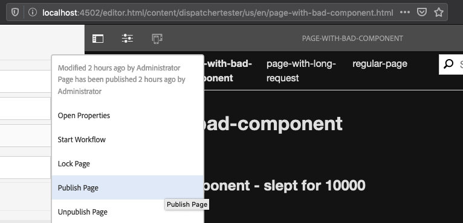
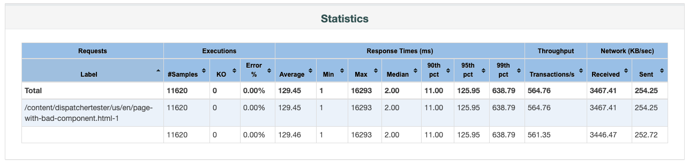
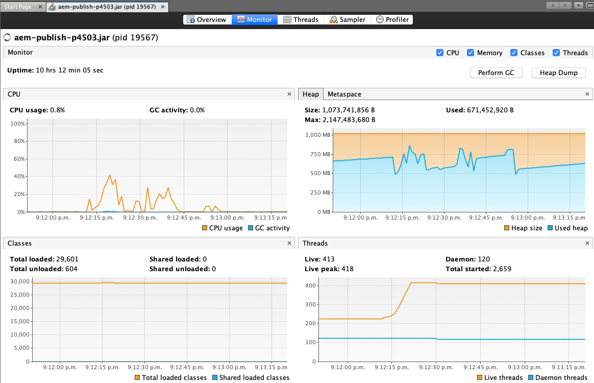
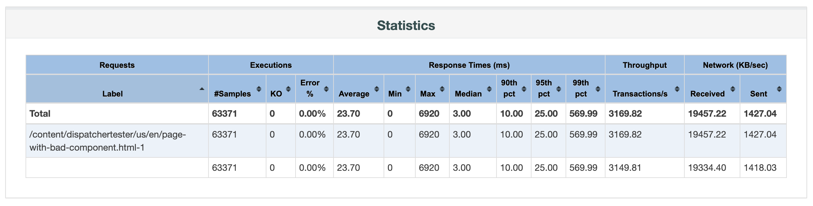

# Effect of Re-fetching Dispatcher Flush

This experiment shows how you can reduce load spikes on high-traffic sites that occur after a flush event (such as a page publish/activation).

## Compatibility

This experiment is only compatible with AEM 6.5. The replication framework from previous versions of AEM is no longer used to publish pages on AEM as a Cloud Service (read the details here: [Content Distribution](https://docs.adobe.com/content/help/en/experience-manager-cloud-service/core-concepts/architecture.html#content-distribution)).

## Setup

To simulate a page that is expensive to render, we will be using the page located at `/content/dispatchertester/us/en/page-with-bad-component`. This page has a component on it which takes a configurable amount of time to render, simulating a slow query or other synchronous process which must complete in order to render the page.

Try it out on the author instance: http://localhost:4502/editor.html/content/dispatchertester/us/en/page-with-bad-component.html

You can configure how many milliseconds the component will sleep for by opening it's dialog in edit mode (default is 10 seconds).

Once this component is cached by the dispatcher, it will render immediately. 

Try accessing: http://aem-publish.local:8080/content/dispatchertester/us/en/page-with-bad-component.html

With an empty cache, the page will take ~10 seconds to render.

**However!** Once the page has rendered once and is present in the cache, it will be render immediately without requiring any of the (simulated) expensive rendering on the publish instance.

Try accessing the above link again, once the initial render has completed. The dispatcher should return the cached page and it will render immediately.


## Problem

When this page is changed on the author instance and Published/Activated, it will be *flushed* (deleted) from the dispatcher's cache. This means that *every request* that is received for this page while it is missing from the cache will make its way back to the publish instance, causing the expensive query or process to fire each time. With a high load, and depending on the scale of the publish tier, this could potentially cause the publish instance to run out of threads or memory.

Try this yourself:

- Open `page-with-bad-component` in author mode: http://localhost:4502/editor.html/content/dispatchertester/us/en/page-with-bad-component.html
- "Publish" the page



- Note how `content/dispatchertester/us/en/page-with-bad-component.html` has been flushed/removed from the dispatcher cache

```
ls /Library/WebServer/docroot/publish/content/dispatchertester/us/en
```

> Did it not get removed? There may be an issue with your publish instance's [Dispatcher Flush agent](../../docs/Flush-agent-setup.md)

Knowing this, how can we support the activation of expensive pages in high load situations?

## Test #1: standard cache flush behavior

With your `Dispatcher Flush (flush)` agent on Publish set up to perform a standard Dispatcher flush (the default), perform the following steps to simulate how your site will respond under high load after a page activation:

1. Open `page-with-bad-component` on your author: http://localhost:4502/editor.html/content/dispatchertester/us/en/page-with-bad-component.html
1. Publish the page. Optionally, you can make a change before publishing, such as including a text component and adding some text.
1. Confirm that `page-with-bad-component.html` is no longer present in the cache: `ls /Library/WebServer/docroot/publish/content/dispatchertester/us/en`
1. In VisualVM, open the AEM publish instance's Java process to the Monitor tab
1. Using the JMeter script included in this directory, generate 100 threads of requests with a 10 second ramp up time, in a continuous manner for 20 seconds total:

```
jmeter -n -Jjmeterengine.force.system.exit=true -t Page-with-bad-component-test-plan.jmx -Jrampup=10 -Jthreads=100 -Jduration=20
```

Note the results that are printed to the console.

```
Run #1:
summary =  13056 in 00:00:23 =  578.2/s Avg:   123 Min:     0 Max: 20807 Err:     0 (0.00%)

Run #2:
summary =  11620 in 00:00:21 =  560.3/s Avg:   129 Min:     1 Max: 16293 Err:     0 (0.00%)
```

For a more detailed report of your test run, use JMeter to parse it's jmeterResults.jtl file into an HTML report:

    jmeter -g jmeterResults.jtl -o report/
    open report/index.html

The Statistics tile in the dashboard has some interesting metrics, including a dramatic range of response times. This is due to the fact that the initial 100 threads all require the publish rendering engine to generate each of them a unique page. Once the page is successfully cached (after ~11.6 seconds in the image), the later requests for this page are served _extremely_ quickly, due in part to JMeter and the dispatcher being collocated on the same machine:



Also note the effect this has on the publish instance. The following screenshot was taken from VisualVM after the test had finished:



In particular, note how the thread count ramped up as the test began, and then remained elevated.

CPU usage does not spike too high since this component is not actually doing anything. In a more "real" scenario where the component is doing something expensive, a spike in CPU would be seen as well.

Now, let's try the same test again with a different Flushing strategy.

## Setting up Re-fetching flush

The steps to enable Re-fetching Dispatcher Flush are detailed in the "Optimizing the Dispatcher cache" HelpX document. Follow the steps in the "Re-fetching Dispatcher Flush" section, making careful note to modify the `Dispatcher Flush (flush)` agent on your **Publish** instance (as opposed to the Agent on author): https://helpx.adobe.com/ca/experience-manager/kb/optimizing-the-dispatcher-cache.html#refetching-flush

A few helpful links:

- Log in to your publish instance: http://localhost:4503/libs/granite/core/content/login.html
- Package manager on publish: http://localhost:4503/crx/packmgr/index.jsp
- The Dispatcher Flush agent on publish: http://localhost:4503/etc/replication/agents.publish/flush.html

## Confirm that Re-fetching flush is working

- Open a page in author mode that is present in the cache, such as [regular-page](http://localhost:4502/editor.html/content/dispatchertester/us/en/regular-page.html) or [page-with-bad-component](http://localhost:4502/editor.html/content/dispatchertester/us/en/page-with-bad-component.html)
- Observe the directory on your filesystem containing the cached page (eg, `ls /Library/WebServer/docroot/publish/content/dispatchertester/us/en`)
- Publish the page

Note how the cached page is _not_ deleted from the cache! In the background, the dispatcher is making a request back to the publish instance to _replace_ the cached file, instead of deleting it. Once the request is complete, the cached page will be replaced.

## Test #2: Re-fetching flush behavior

Perform a similar set of steps that you followed in Test #1:

1. Open `page-with-bad-component` on your author: http://localhost:4502/editor.html/content/dispatchertester/us/en/page-with-bad-component.html
1. Publish the page. Optionally, you can make a change before publishing, such as including a text component and adding some text.
1. _Note!_ This time, `page-with-bad-component.html` will remain present in the cache: `ls /Library/WebServer/docroot/publish/content/dispatchertester/us/en`
1. In VisualVM, open the AEM publish instance's Java process to the Monitor tab
1. Using the JMeter script included in this directory, generate 100 threads of requests with a 10 second ramp up time, in a continuous manner for 20 seconds total:

```
# Remove any previous results, first:
rm -rf report jmeterResults.jtl

# Run the test
jmeter -n -Jjmeterengine.force.system.exit=true -t Page-with-bad-component-test-plan.jmx -Jrampup=10 -Jthreads=100 -Jduration=20
```

Note the results. 

```
Run #1:
summary =  56242 in 00:00:20 = 2776.4/s Avg:    26 Min:     1 Max: 12461 Err:     0 (0.00%)

Run #2:
summary =  63371 in 00:00:20 = 3141.8/s Avg:    23 Min:     0 Max:  6920 Err:     0 (0.00%)
```

If you generate a report (`jmeter -g jmeterResults.jtl -o report/`), you will see that the stats are significantly better than without the re-fetching flush, especially in terms of throughput:



Also note the VisualVM Monitor tab. There are no requests at all which make it back to the publish instance as part of this test, so it's basically idle:


## Conclusion

This experiment has demonstrated how a re-fetching dispatcher flush can significantly reduce the load on your publish tier that spikes after publish/activation events, which in turn reduces response times and increases throughput of your public facing site.

For additional details on re-fetching flush, check out this webinar recording: https://my.adobeconnect.com/p7th2gf8k43
