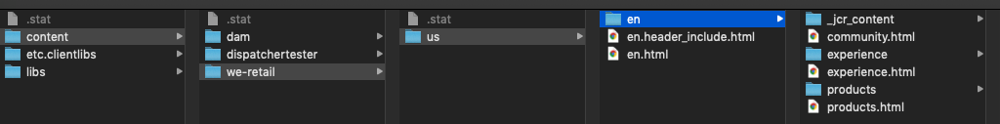

# Effect of a `/statfileslevel` greater than 0

This experiment demonstrates why it is important to set the Dispatcher `/statfileslevel` configuration property to a value greater than 0 (in most cases).

## Compatibility

This experiment is compatible with both AEM 6.5 and AEM as a Cloud Service.

## Problem

When a page is published in a standard (non-TTL based) dispatcher configuration, each of the page's ancestor `.stat` files are "touched", updating their last modified timestamp. Any page which shares one of these `.stat` files as it's _nearest .stat ancestor_ is now considered "invalidated" (in other words: it is now "stale"). 

The next request which is received for invalidated content will be re-fetched from the publish tier.

With `/statfileslevel "0"`, _everything_ in the cache is effectively invalidated when _any_ piece of content is published. This can cause the publish tier to re-render a large amount of content that may not have anything to do with the content which was originally published. As an example: if a page in the English language tree of your site is published, does it make sense to invalidate all French pages too?

For additional detail on `.stat` files, check out the docs: [Invalidating Files by Folder Level](https://docs.adobe.com/content/help/en/experience-manager-dispatcher/using/configuring/dispatcher-configuration.html#invalidating-files-by-folder-level)

## Setup

The [dispatcher.any](../../dispatcher-config-basic/private/etc/apache2/conf/dispatcher.any) file included in this repository is currently set up with a `/statfileslevel` set to "0".

We will be using the We.Retail site for this experiment. Confirm that you have it installed: http://aem-publish.local:8080/content/we-retail/us/en.html

To monitor how requests are being handled, tail the following log files:

1. Tail (in "follow" mode) the dispatcher.log file: 
`tail -f /private/var/log/apache2/dispatcher.log`
1. Also tail the publish instance's request.log file (note the relative path): `tail -f crx-quickstart/logs/request.log`

You might find it helpful to keep these 2 terminal windows side by side.

## Test #1: `/statfileslevel "0"`

### Warm up the cache

1. Navigate to the We.Retail Products page: http://aem-publish.local:8080/content/we-retail/us/en/products.html
1. Ensure that `products.html` and `products/` are present in the cache: 
`ls /Library/WebServer/docroot/publish/content/we-retail/us/en`

If you have the `tree` tool installed, try running it in the `products/` directory to see the amount of content which is cached below this directory:

```
/Library/WebServer/docroot/publish/content/we-retail/us/en/products $ tree -L 3
.
├── _jcr_content
│   ├── contexthub.commerce.orderhistory.json
│   ├── contexthub.commerce.relatedproducts.json
│   ├── contexthub.commerce.smartlists.json
│   └── contexthub.pagedata.json
├── equipment
│   ├── biking
│   │   ├── blast-mini-pump
│   │   ├── comfort-gel-gloves
│   │   ├── compact-chain-tool
│   │   ├── marin-mountain-bike-shoes
│   │   ├── mx121-sport-pedals
│   │   └── sequoia-bike-helmet
│   ├── hiking
│   │   ├── buffalo-plaid-shorts
│   │   ├── candide-trail-short
│   │   ├── corona-shorts
│   │   ├── cuzco
│   │   ├── desert-sky-shorts
│   │   ├── expedition-tech-long-sleeved-shirt
... and lots more!
```

> Note: by default, not all of this content will become invalidated. Typically only .html files would be invalidated, but this can be customized via the `/invalidate` rule. 

### Publish some unrelated content

1. Open the dispatchertester `regular-page` in author mode: http://localhost:4502/editor.html/content/dispatchertester/us/en/regular-page.html
1. Publish `regular-page`

In the root of the dispatcher's cache, there is a file named `.stat`. Check it's last modified timestamp:

```
$ ls -l /Library/WebServer/docroot/publish/.stat
```

The time listed should be the time at which you hit the publish button on your author instance.

### Observe the logs

With an eye on the two log files that you tail'ed above, navigate back to the products page: http://aem-publish.local:8080/content/we-retail/us/en/products.html

Note the dispatcher.log first:

```
[Wed Jul 15 16:14:59 2020] [D] [pid 93607] checking [/content/we-retail/us/en/products.html]
[Wed Jul 15 16:14:59 2020] [D] [pid 93607] cache file is older than lastflush -> flush [/Library/WebServer/docroot/publish/content/we-retail/us/en/products.html]
[Wed Jul 15 16:14:59 2020] [D] [pid 93607] cache-action for [/content/we-retail/us/en/products.html]: CREATE
[Wed Jul 15 16:14:59 2020] [D] [pid 93607] Dropping socket after 1215 seconds of inactivity: 127.0.0.1:4503
[Wed Jul 15 16:14:59 2020] [D] [pid 93607] Creating new connection: 127.0.0.1:4503
[Wed Jul 15 16:14:59 2020] [D] [pid 93607] Connected to backend rend01 (127.0.0.1:4503)
[Wed Jul 15 16:14:59 2020] [D] [pid 93607] Adding request header: Host
[Wed Jul 15 16:14:59 2020] [D] [pid 93607] Adding request header: Pragma
[Wed Jul 15 16:14:59 2020] [D] [pid 93607] Adding request header: Cache-Control
[Wed Jul 15 16:14:59 2020] [D] [pid 93607] Adding request header: Upgrade-Insecure-Requests
[Wed Jul 15 16:14:59 2020] [D] [pid 93607] Adding request header: User-Agent
[Wed Jul 15 16:14:59 2020] [D] [pid 93607] Adding request header: Accept
[Wed Jul 15 16:14:59 2020] [D] [pid 93607] Adding request header: Referer
[Wed Jul 15 16:14:59 2020] [D] [pid 93607] Adding request header: Accept-Encoding
[Wed Jul 15 16:14:59 2020] [D] [pid 93607] Adding request header: Accept-Language
[Wed Jul 15 16:14:59 2020] [D] [pid 93607] Adding request header: Cookie
[Wed Jul 15 16:14:59 2020] [D] [pid 93607] Adding request header: Via
[Wed Jul 15 16:14:59 2020] [D] [pid 93607] Adding request header: X-Forwarded-For
[Wed Jul 15 16:14:59 2020] [D] [pid 93607] Adding request header: Server-Agent
[Wed Jul 15 16:14:59 2020] [D] [pid 93607] Cache file successfully created: /Library/WebServer/docroot/publish/content/we-retail/us/en/products.html
[Wed Jul 15 16:14:59 2020] [D] [pid 93607] Storing socket for later reuse: 127.0.0.1:4503
[Wed Jul 15 16:14:59 2020] [I] [pid 93607] "GET /content/we-retail/us/en/products.html" - miss [publish/rend01] 905ms
```

Despite this file being present in the cache, and a page in a different content tree being published, `products.html` was determined to be stale due to the last modified date on the `.stat` file at the cache root (note the log, `cache file is older than lastflush -> flush`).

Also note the render time: `"GET /content/we-retail/us/en/products.html" - miss [publish/rend01] 905ms` This page took nearly a second to render. With all the other .html files in the We.Retail site considered invalid the moment the publish occurred, this can cause significant load on the publish tier if the system is receiving a number of concurrent requests for various .html pages.

On the positive side, if multiple requests are received for an invalidated resource, **only the first request** will make it's way back to the publish instance. The other requests will be treated as a cache hit, and will be served the "stale" content from the cache.

Need proof? Try the following:

1. Navigate to the [products page](http://aem-publish.local:8080/content/we-retail/us/en/products.html) in 2 separate browsers. Place the browser windows side by side
1. Open the cached products.html file with a text editor: `vi /Library/WebServer/docroot/publish/content/we-retail/us/en/products.html`
1. Locate the `<h1 ` tag, and change "Products" to something else
1. Publish an unrelated page, such as [regular-page](http://localhost:4502/editor.html/content/dispatchertester/us/en/regular-page.html)
1. This part requires fast fingers. Force a hard refresh in the first browser (on Mac) by holding both the ⌘ (Cmd) and ⇧ (Shift) keys, then pressing the R key.
1. _Very quickly_ switch to the 2nd browser and perform the same hard refresh.
1. Observe the result:


In the case pictured above I refreshed the browser on the left first, then quickly refreshed the browser on the right. This resulted in the request from the browser on the left making it back to the publish instance, and the browser on the right was served the "stale" content from the cache (which had been modified).

## Test #1: `/statfileslevel "2"`

### dispatcher.any

Let's try this test again with a different value of `/statfileslevel`.

1. Open dispatcher.any and locate the `/statfileslevel` configuration (you may need to use sudo): `sudo vi /private/etc/apache2/conf/dispatcher.any`
1. Change it's current setting ("0") to "2" (or "3", or "4"): `/statfileslevel "2"`
1. Save dispatcher.any
1. Restart Apache (you may need to use sudo): `sudo apachectl restart`
1. Publish the Products page: http://localhost:4502/editor.html/content/we-retail/us/en/products.html
1. Access the Products page via the dispatcher to warm up the cache: http://aem-publish.local:8080/content/we-retail/us/en/products.html - this step is not needed if you have [re-fetching flush](../refetching-flush) set up.

Observe the cache. Two new `.stat` files have now appeared (assuming you are able to view hidden files on macOS):



With these stat files in place, a publish/activation of any content in the `/content/dispatchertester` tree should not cause the content in `/content/we-retail` to become invalidated.

### Publish some unrelated content

1. Open the dispatchertester `regular-page` in author mode: http://localhost:4502/editor.html/content/dispatchertester/us/en/regular-page.html
1. Publish `regular-page`
1. Compare the timestamps of the two deepest `.stat` files:

```
ls -l /Library/WebServer/docroot/publish/content/dispatchertester/.stat
```

In my case, the above timestamp is the newest: `... 15 Jul 20:50 ...`

```
ls -l /Library/WebServer/docroot/publish/content/we-retail/.stat
```

Slightly older: `... 15 Jul 20:44 ...` - which corresponds with the last modified timestamp on products.html.

### Observe the logs

With an eye on the two log files that you tail'ed above, navigate back to the products page: http://aem-publish.local:8080/content/we-retail/us/en/products.html

Note the dispatcher.log:

```
[Wed Jul 15 20:57:00 2020] [D] [pid 82526] checking [/content/we-retail/us/en/products.html]
[Wed Jul 15 20:57:00 2020] [D] [pid 82526] cache file is newer than lastflush -> use cache [/Library/WebServer/docroot/publish/content/we-retail/us/en/products.html]
[Wed Jul 15 20:57:00 2020] [D] [pid 82526] cache-action for [/content/we-retail/us/en/products.html]: DELIVER
[Wed Jul 15 20:57:00 2020] [D] [pid 82526] request declined
[Wed Jul 15 20:57:00 2020] [I] [pid 82526] "GET /content/we-retail/us/en/products.html" - hit [publish/-] 1ms
```

Cache hit!

## Conclusion

It's important to configure a `/statfileslevel` that makes sense for your site. Most likely this is > `0`, but there may be special cases where `0` is appropriate. For additional detail on stat files, check out [Invalidating Files by Folder Level](https://docs.adobe.com/content/help/en/experience-manager-dispatcher/using/configuring/dispatcher-configuration.html#invalidating-files-by-folder-level).
